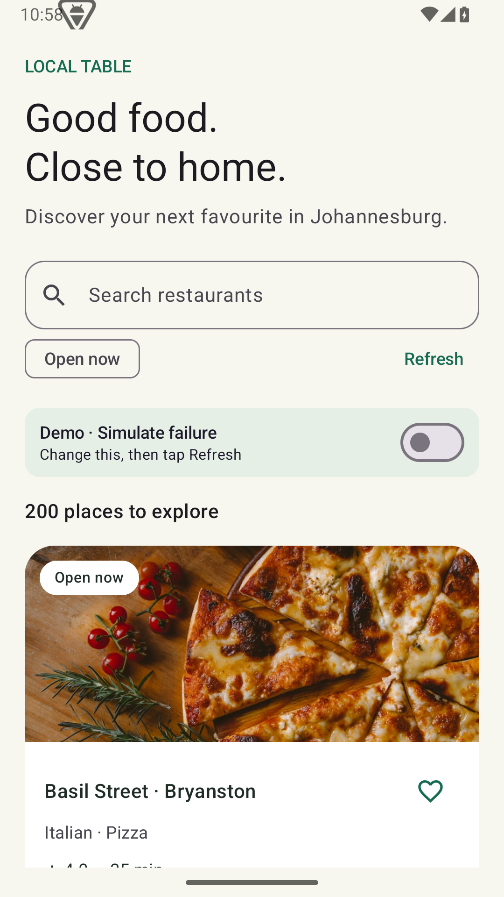
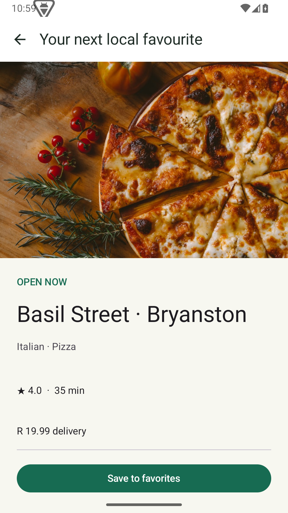

# Local Table · Restaurant Discovery

I built Local Table for my Android technical assessment. It's a Kotlin and Jetpack Compose app for browsing 200 fictional restaurant branches around Johannesburg, checking their details and saving favorites.

This is my own assessment project. It's not an official Mr D or OfferZen app.

## Demo recording

[Watch or download the app demo recording](docs/Recording.mp4). The recording predates the latest refresh-message and route-validation changes.

The video is stored with Git LFS. To download it in a clone, install Git LFS, then run `git lfs install` and `git lfs pull`.

## Screenshots

These captures are from the initial build; some screen labels have since been simplified.

<p>
  
  
</p>

## Running the app

You'll need JDK 17 or 21, Android SDK 36 and an emulator or device running Android 8.0 / API 26 or newer. The project includes the Gradle 9.1.0 wrapper.

1. Open the project in Android Studio and let Gradle sync.
2. Set the SDK path in Android Studio, through `ANDROID_HOME`, or in a local `local.properties` file with `sdk.dir=/your/android/sdk`. That file is ignored by Git.
3. Select the `app` configuration and run it on your device or emulator.

You can also build and install from the terminal:

```sh
./gradlew assembleDebug
adb install -r app/build/outputs/apk/debug/app-debug.apk
```

On Windows, use `gradlew.bat` instead of `./gradlew`.

The restaurant list comes from a JSON file included in the app, so there's no backend or API key to set up. The sample food images come from Unsplash and need internet. Coil caches them and shows a restaurant icon if loading fails. They aren't actual photos of the fictional restaurants.

## What you can do

- Browse restaurants with their cuisines, rating, delivery fee, ETA and open or closed status.
- Search by name and use the Open now filter together.
- Open a restaurant's Details screen.
- Save or remove a favorite from either screen. Favorites stay saved after restarting the app.
- Keep browsing saved restaurants when a refresh fails, then retry.
- See loading, empty results and error messages when appropriate.

Search and Open now use `SavedStateHandle` so Android can restore them when recreating the screen. Missing ratings, fees, ETAs and images have fallbacks.

I kept the scope to restaurant discovery. There are no menus, ordering, payments, accounts or live location features.

## Trying the offline and error states

Debug builds have a **Demo · Simulate failure** switch on Browse. It remembers its setting after restarting the app. Changing the switch affects the next request, so press **Refresh** or **Retry** afterwards. Release builds hide it and disable simulated failures.

To try a failed refresh with saved data:

1. Open the app and let the restaurants load.
2. Save a favorite and check it on Details.
3. Turn on **Simulate failure** and press **Refresh**.
4. The list should stay visible with “Couldn’t refresh. Showing saved restaurants.”
5. Turn the switch off and press **Retry**.

To try a failure with no saved restaurants, turn on the switch, then run these commands against a debug installation:

```sh
adb shell am force-stop com.chinombe.restaurants
adb shell run-as com.chinombe.restaurants rm -f databases/restaurants.db databases/restaurants.db-wal databases/restaurants.db-shm
adb shell am start -n com.chinombe.restaurants/.MainActivity
```

This deletes the app's cached restaurants and favorites but keeps the failure setting. The app should now show the full error state. Turn off the switch and retry to load the data again.

Airplane mode won't make the bundled JSON request fail. That's why I added the switch.

## How it's put together

```text
Compose → ViewModel → RestaurantRepository → RestaurantApi (JSON asset)
                ↑             ↓ refresh transaction
                └──────── Room Flow
```

The screens observe Room through the repository. A successful refresh replaces the restaurant rows in a transaction. If the request fails or has invalid or duplicate IDs, the old list stays in place.

Favorites have their own table so refreshing restaurant data doesn't overwrite them. Both screens get favorite updates from Room.

There's one `app` module, with `data`, `domain`, `ui`, `navigation` and `di` packages under `app/src/main/java/com/chinombe/restaurants`. Hilt provides the dependencies. ViewModels expose StateFlow, and Compose collects it with lifecycle awareness. JSON parsing runs on IO and filtering uses an injected default dispatcher.

I explain the decisions and trade-offs in [SOLUTION.md](SOLUTION.md).

## Versions

These are pinned in the root and app Gradle files:

| Component | Version |
| --- | --- |
| Gradle / Android Gradle Plugin | 9.1.0 / 9.0.1 |
| Kotlin Compose and serialization plugins | 2.2.10 |
| Compose BOM | 2025.08.01 |
| KSP / Hilt | 2.3.9 / 2.60.1 |
| Room | 2.8.4 |
| Lifecycle / Navigation Compose | 2.9.3 / 2.9.3 |
| Coroutines / Kotlin serialization JSON | 1.10.2 / 1.9.0 |
| Coil | 2.7.0 |

The project uses AGP's built-in Kotlin, compile and target SDK 36, minimum SDK 26 and JVM target 17.

## Tests and builds

Run the local tests, lint and debug builds:

```sh
./gradlew assembleDebug testDebugUnitTest lintDebug assembleDebugAndroidTest
```

With an emulator or device connected, run the Android tests:

```sh
./gradlew connectedDebugAndroidTest
```

To build the unsigned release APK:

```sh
./gradlew assembleRelease
```

The tests focus on search and filtering, missing data, formatting, ViewModel states, cancellation, cache preservation and favorites. The Android tests also check Room data after reopening the database, Compose interactions and the full Browse-to-Details flow with simulated failure and recovery.

The review run on 21 September 2026 passed 11 unit tests and 5 emulator tests on API 35. Debug, unsigned release and Android test APK builds passed. Lint reported 0 errors and 18 warnings: 17 dependency-update notices and one base adaptive-icon monochrome notice. An Android 13+ monochrome icon is included. Rerun the checks after changing the code.

## AI use and remaining work

I used Codex to help with the implementation, test code, sample data and documentation. [AI_USAGE.md](AI_USAGE.md) contains my prompts rewritten for this project and explains that they aren't an exact chat transcript.

Paging, server-side search, separate feature modules and performance benchmarks are future work. The current data source is a local mock.

## Author

Tafadzwa Chinombe · [GitHub](https://github.com/chinombe) · [LinkedIn](https://www.linkedin.com/in/tafadzwachinombe/)
